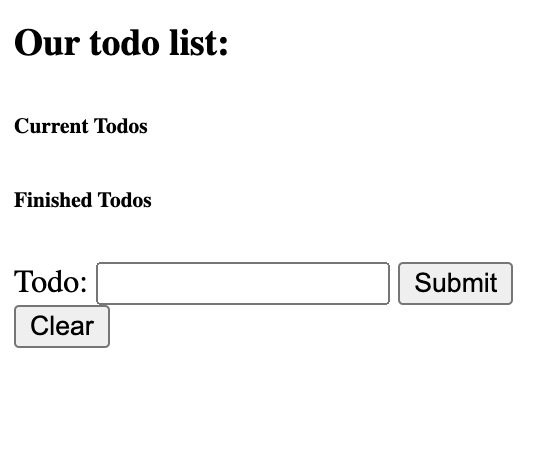
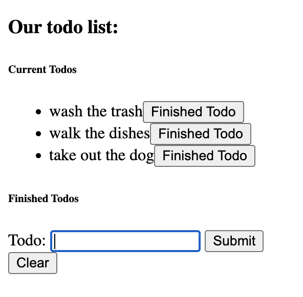
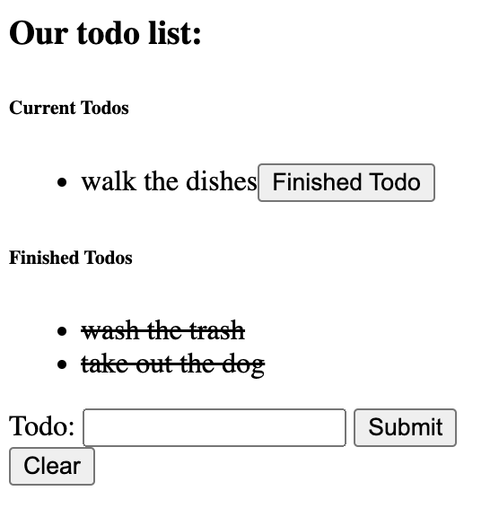

#  HTML Form Lab

---

## Getting started

We are going to be making a todo list app to practice using HTML forms 🚀

* fork and clone this repo
* cd into `js-dom-form-todo-list`
* create an html file and js file, make sure that they are populated and linked up before you get started

## Specifications

Here is what the app will look like:

Our app will require:

* two unordered lists, one for todos and one for finished todos
* a form to submit a new todo
* a button to clear the lists completely (it will clear both finished and unfinished todos)

When the user submits the form with text in it, that text will appear as a todo in the list:

Each Todo should have a button that when clicked, will move the todo to the finished todo list like so:

Finally, when the clear button is clicked, both lists should be emptied out:

### Tips

* break this down into smaller problems
  * first just display a skeleton of html
  * next, make sure your form is submitting with a `console.log`
  * then add some text to the page from the user input in the form
  * once that is finished, add buttons to each todo as they are made 
* wireframing can help plan out the html elements you will need
---

## Licensing
1. All content is licensed under a CC-BY-NC-SA 4.0 license.
2. All software code is licensed under GNU GPLv3. For commercial use or alternative licensing, please contact legal@ga.co.